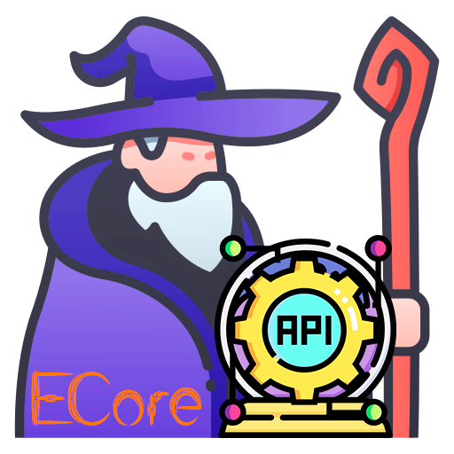

  
  

# EverNifeCore

This is the base plugin for all my other plugins.

This plugin was never intended to be open to public, but here we are.

To build this plugin you will require a few dependencies that are private or paid.

If you really want to build this project, remove the code that depends on "EverForgeLib" as this is my Forge library for some mods.

## API

This plugin holds several APIs for many different things like Player Management, File Handling, Commands, Localization, Database Manipulation, etc.
