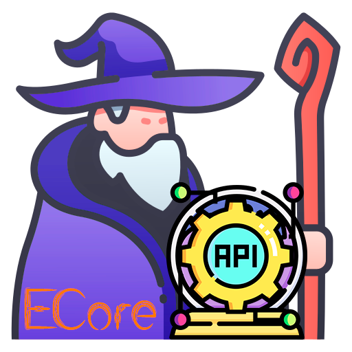

[](https://discord.petrus.dev/)
[](https://www.spigotmc.org/resources/97739/)

<p align="center">
  
  <br>
  
</p>

# EverNifeCore

> A core, platform-agnostic framework for making Bukkit plugins and Hytale mods.

Write commands, configs, messages and player data once, against an API that has no idea which server
it is running on. The same command class compiles and runs on Bukkit/Spigot/Paper and on Hytale; the
same player data can live in flat files, MySQL, PostgreSQL, H2 or MongoDB, chosen by the server owner
in a config file rather than by you in code.

## 📖 The documentation is the wiki

**This page is a tour.** The full developer guide - every API, every contract, every trap - is the
**[EverNifeCore Wiki](https://github.com/EverNife/EverNifeCore/wiki)**.

| Start here | |
|---|---|
| [Installation](https://github.com/EverNife/EverNifeCore/wiki/Installation) | the repository and the one `compileOnly` dependency |
| [Quick Start](https://github.com/EverNife/EverNifeCore/wiki/Quick-Start) | a complete minimal plugin: command, config, localized message |
| [Architecture Overview](https://github.com/EverNife/EverNifeCore/wiki/Architecture-Overview) | `common` with zero Bukkit imports, the two platforms, the startup sequence |
| [Gotchas & Pitfalls](https://github.com/EverNife/EverNifeCore/wiki/Gotchas-and-Pitfalls) | the behavioral traps, before you hit them |

## 🚀 Install

### Server owners

1. Download the latest JAR from [Releases](https://github.com/EverNife/EverNifeCore/releases)
2. Drop it in `plugins/`
3. Start the server (do not reload it)

### Developers

```groovy
repositories {
    maven { url = 'https://maven.petrus.dev/public' }
}

dependencies {
    // Bukkit/Spigot/Paper - the fat jar already carries the common API.
    compileOnly 'br.com.finalcraft:evernifecore-minecraft:3.0.1'
}
```

Hytale, the thin common artifact and the relocated view are on
[Installation](https://github.com/EverNife/EverNifeCore/wiki/Installation).

---

# What it looks like

## Commands

A command is a plain class. Parameters are injected and parsed: `<arg>` is required, `[arg]` is
optional, and `@Arg.Flag` binds a `--name value` flag that may appear anywhere on the line.

```java
@FinalCMD(
  aliases = {"greet", "hi"}, 
  permission = "myplugin.greet"
)
public class GreetCommand {

    @FinalCMD.SubCMD(
      subcmd = "bonus", 
      permission = "myplugin.greet.bonus"
    )
    public void setBonus(FCommandSender sender,
                         @Arg("<player>") FPlayer target,
                         @Arg("<amount>") Integer amount,
                         @Arg.Flag(value = "--silent", aliases = "-s", def = "false") Boolean silent) {
        // parsed, permission-checked, tab-completed and help-generated for you
    }
}

FinalCMDManager.registerCommand(ecPluginData, GreetCommand.class);
```

Registration builds a command **tree**: nodes are walked and dispatched in ordered phases, permission
and validation are evaluated over the whole path, and tab-completion is answered from the tree.

📖 [Command Framework](https://github.com/EverNife/EverNifeCore/wiki/Command-Framework) ·
[Argument Parsing](https://github.com/EverNife/EverNifeCore/wiki/Argument-Parsing) ·
[Flags](https://github.com/EverNife/EverNifeCore/wiki/Flags)

## Configuration

YAML (or TOML/JSON) with inline comments generated from your code - you never ship a bundled default
file. `getOrSetValueIfAbsent` reads the key, or seeds it with its comment the first time.

```java
Config config = ConfigFactory.open(ecPluginData, "config.yml");

int joinBonus = config.getOrSetValueIfAbsent(
  "settings.join-bonus",
  100,
  "Bonus shown to a player when they run /greet me."
);
```

Teaching the config a new type is one registration, and it then works everywhere - solo value, POJO
field, map value, list element:

```java
ConfigFactory.register(MyData.class).asMap(MyData::toMap, MyData::fromMap);   // object-shaped
ConfigFactory.register(MyId.class).asString(MyId::toString, MyId::parse);     // scalar, usable as a key
```

If your type is already an POJO there is no need to even register it at all. Use normal Jackson Annotations
to ignore some fields and that's it.

📖 [Configuration](https://github.com/EverNife/EverNifeCore/wiki/Configuration)

## Player data

A `PDSection` is a plain Jackson POJO. Mutate the fields, call `markDirty()`, and the flush pipeline
persists it. That is the whole persistence API.

```java
public class JobsSection extends PDSection {
    public int level;
    public String job = "none";

    public void levelUp() {
        level++;
        markDirty();
    }
}

// once, at enable - the id is the stable storage identity, so the class can be renamed freely
PlayerController.registerPDSectionCfg(ecPluginData, JobsSection.class, "jobs");

// reads are 100% async; on a cached online player the future is already completed
PlayerController.getPDSection(uuid, JobsSection.class).thenAccept(JobsSection::levelUp);
```

📖 [PlayerData & PDSections](https://github.com/EverNife/EverNifeCore/wiki/PlayerData-and-PDSections) ·
[Accounts](https://github.com/EverNife/EverNifeCore/wiki/Accounts) ·
[Cooldowns](https://github.com/EverNife/EverNifeCore/wiki/Cooldowns)

## Storage

Where that data physically lives is the **admin's** decision, in `storage.yml`. The developer advises
a default; nobody has to recompile anything to move a collection to MySQL.

```yaml
storage-backends:
  playerdata:                  # what belongs to ONE player on THIS server
    enabled: true
    type: groupedfile
    path: plugins/EverNifeCore/StorageData/PlayerData
  networkdata:                 # what the whole network must agree on
    enabled: true
    type: groupedfile
    path: plugins/EverNifeCore/StorageData/NetworkData
  mysql:
    enabled: false
    type: sql
    url: "jdbc:mysql://localhost:3306/minecraft"
```

Backends are named by **role**, not by technology: a single server is a network of one, and when a
second server joins you point `networkdata` at a shared database and nothing else changes. Backends
supported: grouped files, local files, MySQL/MariaDB, PostgreSQL, H2, MongoDB, in-memory. Moving live
data between them is a runtime command (`/ecstorage transfer`), not a migration script.

📖 [Storage Backends](https://github.com/EverNife/EverNifeCore/wiki/Storage-Backends) ·
[Inline Backends for Plugins](https://github.com/EverNife/EverNifeCore/wiki/Inline-Stroage-Backends-for-Plugins) ·
[Legacy Data Migration](https://github.com/EverNife/EverNifeCore/wiki/Legacy-Data-Migration)

## Messages, localization and rich text

Every message declares its translations inline and is synced to an editable language file per plugin,
so a server owner rewords it without touching your jar. `${key}` placeholders are declared bare and
cited with their delimiters.

```java
@FCLocale(lang = LocaleType.EN_US, text = "&aWelcome, ${player}&a! Your bonus is &6${bonus}&a.")
@FCLocale(lang = LocaleType.PT_BR, text = "&aBem-vindo, ${player}&a! Seu bônus é &6${bonus}&a.")
public static LocaleMessage WELCOME;

WELCOME.addPlaceholder("player", player.getName())
       .addPlaceholder("bonus", joinBonus)
       .send(player);
```

`FancyText` is the rich-text interface: `FancySegment` is one styled piece, `FancyFormatter` an
ordered chain of pieces.

```java
FancyText.of("&aClick here to teleport!")
        .setHover("&7Teleports you to spawn")
        .setClickCommand("/spawn")
        .send(player);

FancyText.of("&6Legendary Sword")
        .setHoverItem("minecraft:diamond_sword")
        .send(player);
```

📖 [Localization](https://github.com/EverNife/EverNifeCore/wiki/Localization) ·
[FancyText](https://github.com/EverNife/EverNifeCore/wiki/FancyText) ·
[Placeholders](https://github.com/EverNife/EverNifeCore/wiki/Placeholders)

## Items and GUIs

```java
ItemStack reward = FCItemFactory.from(Material.DIAMOND_SWORD)
  .displayName("&bExcalibur") // color codes translated for you
  .lore("&7A legendary blade", "&7+10 damage")
  .addEnchant(Enchantment.DAMAGE_ALL, 5)
  .setGlow()
  .setUnbreakable()
  .build();

builder.asGuiItem();          // straight into the GUI layer
builder.asLayout();           // a LayoutIcon for the config-driven layout system
```

The builder clones its source, so the original stack is never mutated, and it falls back to raw NBT on
legacy versions where the modern API does not exist.

📖 [Items & NBT](https://github.com/EverNife/EverNifeCore/wiki/Items-and-NBT) ·
[GUI Framework](https://github.com/EverNife/EverNifeCore/wiki/GUI-Framework)

## Multi-platform

`common` has **zero** Bukkit imports. Platform behaviour reaches it two ways: runtime providers
registered by the platform entry point, and compile-time stubs that each platform replaces with a real
class of the same fully-qualified name. Your code takes `FPlayer` and `FCommandSender` and never asks
which server it is on.

| Platform | Module | Deployable artifact |
|---|---|---|
| Bukkit / Spigot / Paper (1.7.10 - 1.21) | `minecraft` | `minecraft:shadowJar` |
| Hytale | `hytale` | `hytale:shadowJar` (classifier `Hytale`) |

One JDK 25 toolchain compiles everything; the Bukkit side emits Java 8 bytecode against a Java 8 API
floor, so one jar covers 1.7.10 through 1.21.

📖 [Platform Abstraction](https://github.com/EverNife/EverNifeCore/wiki/Platform-Abstraction) ·
[Hytale Platform](https://github.com/EverNife/EverNifeCore/wiki/Hytale-Platform) ·
[Version Compatibility](https://github.com/EverNife/EverNifeCore/wiki/Version-Compatibility) ·
[Java Versions & Toolchains](https://github.com/EverNife/EverNifeCore/wiki/Java-Versions-and-Toolchains)

## And the rest

Sync and async scheduling on virtual threads where the runtime has them, per-server and per-player
cooldowns that can be network-wide, accounts that link a player's data across alt logins, paginated
chat views, and a headless test engine published as `evernifecore-common-tests` so a plugin can test
against platform doubles instead of a running server.

📖 [Scheduler & Threading](https://github.com/EverNife/EverNifeCore/wiki/Scheduler-and-Threading) ·
[Cooldowns](https://github.com/EverNife/EverNifeCore/wiki/Cooldowns) ·
[Accounts](https://github.com/EverNife/EverNifeCore/wiki/Accounts) ·
[full wiki index](https://github.com/EverNife/EverNifeCore/wiki)

---

## 🔌 Integrations

Each one is optional and degrades quietly when its plugin is absent.

| Integration | What you get |
|---|---|
| **Vault / VaultUnlocked** | one economy API over whatever the server runs - [Economy](https://github.com/EverNife/EverNifeCore/wiki/Economy) |
| **PlaceholderAPI** | resolve placeholders and register your own namespace |
| **LuckPerms** | read a player's meta values |
| **WorldEdit** | schematic pasting |
| **WorldGuard / GriefDefender / GriefPreventionPlus** | one `canBuild`/`canBreak`/`canInteract` answer over every installed protection plugin |
| **BossShopPro** | shop items carrying EverNifeCore NBT data parts |

📖 [Integrations](https://github.com/EverNife/EverNifeCore/wiki/Integrations)

## 🧱 Built on

- **[EveryDatabase](https://github.com/EverNife/EveryDatabase)** - the storage engine: entities,
  codecs, caching, references, backend drivers.
- **[EveryConfig](https://github.com/EverNife/EveryConfig)** - the Jackson-first YAML layer: typed
  reads/writes, inline comments, async saves.
- **[EveryLibs](https://github.com/EverNife/EveryLibs)** - reflection, executor and collection helpers.

All three are `api` dependencies of `common`, so their types are part of its public API.

## 🤝 Building

Building the whole project needs a few jars that cannot be fetched from a
public repository (paid or unobtainable plugins used by the integration modules); `common`,
`api-contracts` and `libby` build without them.

📖 [Building from Source](https://github.com/EverNife/EverNifeCore/wiki/Building-from-Source) ·
[Project Layout](https://github.com/EverNife/EverNifeCore/wiki/Project-Layout) ·
[CHANGELOG](CHANGELOG.MD)

## 📞 Support

- **Discord**: [Join our community](https://discord.petrus.dev/)
- **SpigotMC**: [Plugin page](https://www.spigotmc.org/resources/97739/)
- **Issues**: [GitHub Issues](https://github.com/EverNife/EverNifeCore/issues)

---

<p align="center">
  <strong>Developed with ❤️ by <a href="https://github.com/EverNife">EverNife</a></strong>
  <br>
  <em>Empowering Minecraft plugin development since 2016</em>
</p>
